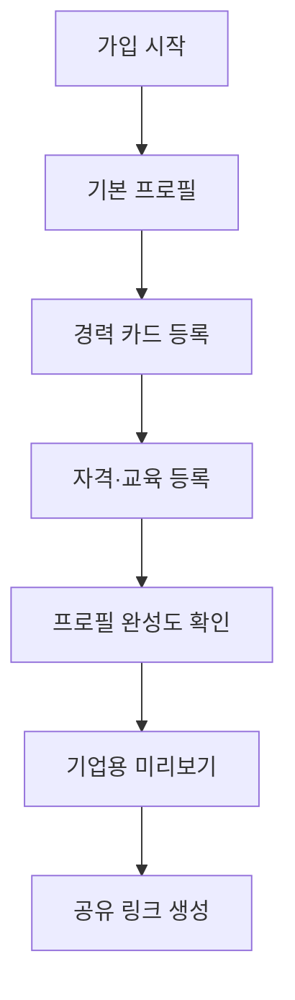
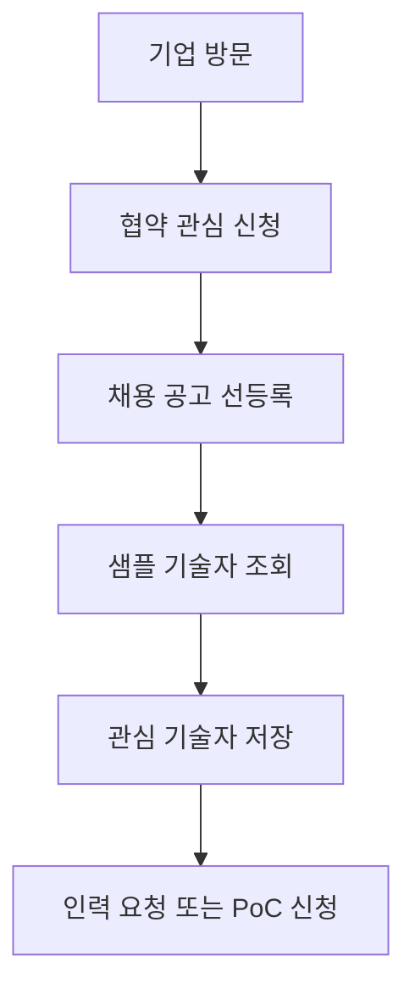

# MONO MVP 개발 계획서

## 1. 개발 목적

MONO MVP는 단순 시연용 프로토타입이 아니라 정식 오픈을 전제로 한 검증형 MVP이다. 초기 목표는 기능을 많이 만드는 것이 아니라, 기술자와 기업이 실제로 원하는 신뢰 데이터와 산업 운영 기능을 행동 데이터로 검증하는 것이다.

핵심 전략은 앱 광고로 기술자를 먼저 모으는 방식이 아니라, 기업 협약과 채용 공고를 먼저 확보한 뒤 실제 현장 수요를 기반으로 기술자를 유입시키는 Demand-first Industrial Workforce Marketplace 전략이다.

MONO MVP는 다음을 증명해야 한다.

| 검증 목표 | 설명 |
|---|---|
| 기술자 신뢰 프로필 수요 | 기술자가 경력, 자격, 교육, 장비 사용 이력을 프로필로 남기고 싶어 하는지 확인 |
| 기업 채용 수요 | 기업이 채용 공고와 현장 인력 수요를 등록하고 기술자 데이터를 조회하려는지 확인 |
| 반복 사용 이유 | 어떤 행동이 7일, 14일, 30일 재방문으로 이어지는지 확인 |
| 산업 확장성 | MONO Gear, 외국인 기술인력 관리, 금융, 보험, 교육 연계 가능성 확인 |
| 심사 대응력 | 모두의 창업 2라운드, 3라운드에서 제시 가능한 정량 데이터와 운영 증거 확보 |

---

## 2. 서비스 구성 및 URL

| 구분 | URL | 주요 목적 |
|---|---|---|
| 사용자 웹 | `https://mono.dojiung.com` | MONO 소개, 기술자 유입, 회원가입, 프로필 생성 시작 |
| 사용자 앱 | `https://mono.dojiung.com/mobile` | 모바일 앱형 UX, 기술자 프로필 작성, 경력 카드 관리 |
| 마케팅 분석 웹 | `https://mono.dojiung.com/analys` | 퍼널, 리텐션, Aha Moment, 관심 기능, 기업 수요 분석 |
| 관리자 앱 | `https://mono.dojiung.com/amono` | 회원, 프로필, 기업, 공고, 이벤트 로그, 인터뷰, PoC 관리 |
| 기업용 웹 | `https://mono.dojiung.com/partner` | 기업 협약, 채용 공고 선등록, 기술자 샘플 프로필 조회 |

참고: 요청에는 `mono.djiung.com/partner`로 기재되어 있으나 기존 도메인 체계와 맞추려면 `mono.dojiung.com/partner`가 자연스럽다. 배포 전 최종 도메인을 확정한다.

---

## 3. MVP 개발 기본 원칙

## 3-1. 운영 단계 수준 UI/UX

MVP라도 사용자가 보는 화면은 실제 서비스처럼 완성도 있게 만든다.

| 원칙 | 적용 기준 |
|---|---|
| 정식 서비스 톤 | `Beta`, `Prototype`, `Test`, `개발 예정` 같은 내부 표현 미노출 |
| 모바일 우선 | 현장 기술자가 휴대폰으로 가입, 프로필 작성, 경력 등록 가능 |
| 한 화면 한 행동 | 가입, 직군 선택, 경력 등록, 관심 신청 등 행동을 명확히 분리 |
| 즉시 보상 | 프로필 완성도, 기업용 미리보기, 공유 링크, PDF 요약서 제공 |
| 쉬운 문장 | 스타트업/데이터/PMF 용어 대신 현장 사용자가 이해하는 표현 사용 |
| 신뢰 안내 | 개인정보, 공개 범위, 기업 열람 여부, 관심 신청 상태 명확히 안내 |

## 3-2. 미구현 기능 처리 원칙

구현이 안 된 기능은 숨기지 않는다. 대신 목적에 맞게 관심 신청, 우선 안내, 시범 운영 신청으로 처리한다.

| 내부 의미 | 사용자 표현 |
|---|---|
| Fake Door | 관심 신청 |
| 프로필 검증 테스트 | 내 경력 인증 관심 신청 |
| 금융 수요 테스트 | 금융 혜택 관심 등록 |
| 기업 조회 수요 | 기업에게 보여줄 프로필 만들기 |
| 외국인 비자 관리 테스트 | 체류·고용 관리 관심 등록 |
| MONO Gear 수요 테스트 | 전문 장비 활용 관심 등록 |

---

## 4. 단계별 개발 및 배포 계획

## Phase 0. 전략/랜딩 정리

목표: 사용자가 MONO를 실제 서비스로 인식하고, 기업이 채용 공고 선등록을 할 수 있는 구조를 만든다.

| 접점 | 구현 내용 |
|---|---|
| 사용자 웹 | MONO 소개, 기술자 신뢰 프로필 가치, 프로필 만들기 CTA |
| 기업용 웹 | 기업 협약 신청, 채용 공고 선등록, 샘플 기술자 프로필 안내 |
| 마케팅 분석 웹 | 방문자, CTA 클릭, 관심 신청 기본 이벤트 확인 |
| 관리자 앱 | 신청자, 기업 문의, 채용 공고 신청 목록 확인 |

완료 기준:

- 사용자 웹과 기업용 웹에서 주요 CTA 클릭 가능
- 기업 협약/공고 선등록 신청 저장 가능
- 주요 CTA 이벤트 로그 수집 가능

## Phase 1. 기술자 프로필 MVP

목표: 기술자가 자신의 경력과 자격을 신뢰 프로필로 만들 수 있게 한다.

| 기능 | 우선순위 | 구현 위치 |
|---|---|---|
| 회원가입 | P0 | 사용자 웹, 사용자 앱 |
| 90초 기본 프로필 | P0 | 사용자 앱 |
| 직군 선택 | P0 | 사용자 앱 |
| 경력 연차 입력 | P0 | 사용자 앱 |
| 희망 지역 선택 | P0 | 사용자 앱 |
| 경력 카드 1건 등록 | P0 | 사용자 앱 |
| 자격증·교육 이력 등록 | P0 | 사용자 앱 |
| 프로필 완성도 | P0 | 사용자 앱 |
| 기업용 프로필 미리보기 | P0 | 사용자 앱 |
| 프로필 공유 링크 | P0 | 사용자 앱, 사용자 웹 |
| PDF 경력 요약서 | P1 | 사용자 앱 |

기술자 기본 흐름:

## Phase 2. 기업 협약 및 채용 공고 선등록

목표: 기술자 풀보다 먼저 기업의 실제 수요를 확보한다.

| 기능 | 우선순위 | 구현 위치 |
|---|---|---|
| 기업 관심 신청 | P0 | 기업용 웹 |
| 기업 정보 입력 | P0 | 기업용 웹 |
| 채용 공고 선등록 | P0 | 기업용 웹 |
| 필요 직군/경력/자격 입력 | P0 | 기업용 웹 |
| 현장 지역/근무 조건 입력 | P0 | 기업용 웹 |
| 기술자 샘플 프로필 조회 | P0 | 기업용 웹 |
| 관심 기술자 저장 | P0 | 기업용 웹 |
| 인력 요청 양식 | P1 | 기업용 웹 |
| PoC 관심 신청 | P1 | 기업용 웹 |
| 장비+기술자 패키지 관심 | P1 | 기업용 웹 |

기업 기본 흐름:

## Phase 3. 관리자 앱

목표: 운영자가 기술자, 기업, 공고, 이벤트, 인터뷰, PoC를 관리할 수 있게 한다.

| 메뉴 | 기능 |
|---|---|
| Overview | 가입자 수, 기업 신청 수, 프로필 완성 수, 공고 등록 수 |
| 기술자 관리 | 회원 목록, 프로필 완성도, 경력/자격 등록 상태 |
| 기업 관리 | 기업 문의, 협약 상태, 담당자 정보 |
| 채용 공고 관리 | 공고 등록, 승인, 노출, 마감 처리 |
| 프로필 조회 관리 | 기업 조회 수, 관심 저장 수, 공개 범위 |
| 이벤트 로그 | 사용자/기업/운영 이벤트 검색 |
| 인터뷰 관리 | 기술자 인터뷰, 기업 인터뷰, 현장 반장/인력사무소 인터뷰 |
| PoC 관리 | PoC 논의, MOU, LOI, 산업 파트너 파이프라인 |

## Phase 4. 마케팅 분석 웹

목표: 모두의 창업 심사, 투자자 커뮤니케이션, 제품 개선을 위한 데이터 검증 화면을 만든다.

| 대시보드 | 목적 |
|---|---|
| Overview Dashboard | 방문자, 가입자, 기업 신청, 프로필 완성, 공고 등록, PoC 관심 수 확인 |
| 가입 Funnel | 방문 -> 가입 시작 -> 가입 완료 |
| 프로필 Funnel | 가입 -> 프로필 작성 -> 경력 등록 -> 자격증 등록 -> 프로필 완성 |
| 기업 Funnel | 기업 방문 -> 관심 신청 -> 기업 등록 -> 공고 등록 -> 프로필 조회 -> 관심 저장 -> PoC 신청 |
| Aha Moment Dashboard | 후보 행동별 재방문율 비교 |
| Retention Dashboard | 7일, 14일, 30일 코호트 재방문율 확인 |
| Interest Feature Dashboard | 경력 인증, 금융, 보험, MONO Gear, 외국인 관리 관심도 |
| MONO Gear Dashboard | 전문 장비 활용 관심, 장비+기술자 패키지 클릭률 |
| 기업 수요 Dashboard | 채용 공고 등록, 기술자 조회, 관심 저장, 인력 요청, PoC 신청 |

## Phase 5. 2라운드 이후 확장

목표: 2라운드 검증 데이터를 기반으로 3라운드에서 산업 파트너, 금융권, VC가 검토할 수 있는 확장성을 보여준다.

| 확장 기능 | 목적 |
|---|---|
| 투자자용 데이터 대시보드 | 검증 결과 시각화 |
| 기업 PoC 관리 화면 | 시범사업 후보 관리 |
| 산업 파트너 파이프라인 | MOU, LOI, PoC 상태 관리 |
| 금융권 제안용 데이터 리포트 | 포용금융, 보험, 대안 신용 근거 제공 |
| 외국인 기술인력 관리 SaaS 초안 | 체류, 고용, 경력, 안전 데이터 관리 가능성 검증 |

---

## 5. 화면별 개발 요구사항

## 5-1. 사용자 웹

| 화면 | 기능 | CTA |
|---|---|---|
| 랜딩 | MONO 가치 설명, 기업 공고 기반 일자리 구조 안내 | 프로필 만들기 |
| 기술자 소개 | 경력 카드, 자격, 교육, 기업 미리보기 설명 | 내 경력 등록하기 |
| 채용 수요 안내 | 협약 기업 공고가 먼저 등록되는 구조 설명 | 공고 알림 받기 |
| 관심 기능 | 경력 인증, 금융, 보험, 전문 장비 활용 | 관심 등록 |

## 5-2. 사용자 앱

| 화면 | 개발 기준 |
|---|---|
| 온보딩 | 첫 문장: “내 경력과 기술을 신뢰 프로필로 만들어보세요.” |
| 기본 프로필 | 이름, 직군, 경력 연차, 희망 지역을 선택형 입력으로 처리 |
| 경력 카드 | 현장명, 작업 분야, 근무 기간, 역할, 사용 장비, 메모 |
| 자격·교육 | 자격증, 안전교육, 교육 이력 입력 |
| 프로필 완성도 | 0~100%, 다음 행동 추천 |
| 기업 미리보기 | 기업이 보게 될 프로필 형태 제공 |
| 공유 링크 | 프로필 외부 전달 및 공유 행동 측정 |
| 관심 기능 | 신청형 카드와 친절한 안내 팝업 |

## 5-3. 기업용 웹

| 화면 | 개발 기준 |
|---|---|
| 기업 랜딩 | “채용 공고를 먼저 등록하면 검증 기술자 풀을 우선 안내” 메시지 |
| 기업 신청 | 회사명, 담당자, 연락처, 업종, 현장 지역 |
| 채용 공고 등록 | 직군, 인원, 경력, 자격, 지역, 기간, 근무 조건 |
| 샘플 프로필 조회 | 경력, 자격, 교육, 현장 경험 중심의 기술자 카드 |
| 관심 기술자 저장 | 실제 기업 수요 행동 측정 |
| PoC 신청 | 협약/시범 운영 전환 |

## 5-4. 관리자 앱

관리자 앱은 운영용이므로 빠른 검색, 필터, 상태 변경이 중요하다.

| 관리 대상 | 상태값 |
|---|---|
| 기술자 | 가입, 프로필 작성 중, 프로필 완성, 공유 완료 |
| 기업 | 문의, 검토 중, 협약 후보, 공고 등록, PoC 논의 |
| 채용 공고 | 작성 중, 승인 대기, 노출 중, 마감 |
| 관심 기능 | 클릭, 신청 완료, 인터뷰 전환 |
| 파트너 | 접촉, 미팅, PoC 논의, MOU, LOI |

---

## 6. 미구현 기능 팝업 문구

| 기능 | 사용자 팝업 문구 |
|---|---|
| 경력 인증 | “경력 인증 기능은 더 신뢰도 높은 프로필을 만들기 위한 기능입니다. 관심 신청을 남겨주시면 우선 안내드리겠습니다.” |
| 금융 혜택 | “근무이력과 경력 데이터를 바탕으로 받을 수 있는 금융 혜택을 준비하고 있습니다. 관심 등록 시 제휴 서비스가 열릴 때 먼저 안내드리겠습니다.” |
| 보험 연계 | “현장 안전과 장비 활용에 맞는 보험 연계를 준비하고 있습니다. 관심 등록 시 우선 안내드리겠습니다.” |
| 전문 장비 활용 | “전문 장비와 IoT 계측기를 필요한 시점에 활용할 수 있도록 준비하고 있습니다. 관심 장비를 선택해주시면 수요가 많은 장비부터 우선 검증하겠습니다.” |
| 외국인 체류·고용 관리 | “체류, 고용 가능 기간, 안전교육, 현장 이력을 함께 관리하는 기능을 기업 PoC 대상으로 검증 중입니다.” |
| 안심 정산 | “안심 정산은 제휴 및 법률 검토 후 단계적으로 제공됩니다. 관심 등록 시 우선 안내드리겠습니다.” |
| 채용 지원 | “현재는 협약 기업 공고부터 순차적으로 지원 기능을 열고 있습니다. 관심 등록 시 우선 안내드리겠습니다.” |
| 기업 열람권 | “기업용 프로필 열람은 협약 기업 대상으로 우선 제공됩니다.” |

---

## 7. 이벤트 로그 설계

## 7-1. 사용자 이벤트

| 이벤트명 | 설명 |
|---|---|
| page_view | 페이지 조회 |
| onboarding_viewed | 온보딩 조회 |
| onboarding_cta_clicked | 온보딩 CTA 클릭 |
| signup_started | 가입 시작 |
| signup_completed | 가입 완료 |
| job_type_selected | 직군 선택 |
| region_selected | 희망 지역 선택 |
| career_year_selected | 경력 연차 선택 |
| profile_started | 프로필 작성 시작 |
| profile_basic_completed | 기본 프로필 완료 |
| career_added | 경력 등록 |
| career_three_added | 경력 3건 등록 |
| certificate_added | 자격증 등록 |
| education_added | 교육 이력 등록 |
| equipment_used_added | 사용 장비 등록 |
| profile_completion_viewed | 프로필 완성도 조회 |
| profile_completed | 프로필 완성 |
| profile_previewed | 기업용 미리보기 조회 |
| profile_shared | 프로필 공유 |
| pdf_downloaded | 경력 요약서 다운로드 |
| return_visit | 재방문 |
| profile_updated | 프로필 수정 |
| notification_clicked | 알림 클릭 |

## 7-2. 관심 기능 이벤트

| 이벤트명 | 설명 |
|---|---|
| career_verification_interest_clicked | 경력 인증 관심 클릭 |
| finance_benefit_interest_clicked | 금융 혜택 관심 클릭 |
| insurance_interest_clicked | 보험 관심 클릭 |
| equipment_rental_interest_clicked | 전문 장비 활용 관심 클릭 |
| foreign_worker_management_interest_clicked | 외국인 근로자 관리 관심 클릭 |
| safe_payment_interest_clicked | 안심 정산 관심 클릭 |
| company_view_interest_clicked | 기업 열람권 관심 클릭 |

## 7-3. 기업 이벤트

| 이벤트명 | 설명 |
|---|---|
| company_signup_started | 기업 가입 시작 |
| company_signup_completed | 기업 가입 완료 |
| company_interest_submitted | 기업 관심 신청 |
| job_post_started | 채용 공고 작성 시작 |
| job_post_submitted | 채용 공고 등록 |
| worker_search | 기술자 검색 |
| worker_profile_viewed | 기술자 프로필 조회 |
| worker_saved | 관심 기술자 저장 |
| workforce_request_submitted | 인력 요청 제출 |
| poc_interest_clicked | PoC 관심 신청 |
| company_return_visit | 기업 재방문 |

## 7-4. 운영 이벤트

| 이벤트명 | 설명 |
|---|---|
| interview_created | 인터뷰 등록 |
| interview_completed | 인터뷰 완료 |
| partner_contact_created | 파트너 접촉 등록 |
| poc_discussion_started | PoC 논의 시작 |
| mou_discussion_started | MOU 논의 시작 |
| loi_received | LOI 수신 |

---

## 8. 핵심 지표 체계

## 8-1. North Star Metric

| 지표 | 정의 |
|---|---|
| 검증 가능한 기술자 프로필 완성 수 | 기본 정보, 직군, 경력 1건 이상, 자격증 또는 교육 1건 이상, 희망 지역이 입력된 프로필 수 |

## 8-2. 보조 North Star

| 지표 | 정의 |
|---|---|
| 기업이 조회한 검증 프로필 수 | 기업이 실제로 기술자 프로필을 조회한 횟수 |
| 기업 채용 공고 등록 수 | 기업이 MONO에 실제 현장 수요를 입력한 횟수 |
| 관심 기술자 저장 수 | 기업이 기술자 데이터를 가치 있다고 판단한 행동 |

## 8-3. Aha Moment 후보

| 대상 | 후보 행동 |
|---|---|
| 기술자 | 가입 후 7일 이내 프로필 80% 이상 완성 |
| 기술자 | 가입 후 7일 이내 경력 3건 이상 등록 |
| 기술자 | 자격증과 경력 정보를 모두 등록 |
| 기술자 | 프로필 공유 링크 생성 |
| 기술자 | 기업 조회 알림 수신 |
| 기업 | 첫 세션에서 기술자 3명 이상 조회 |
| 기업 | 관심 기술자 1명 이상 저장 |
| 기업 | 채용 공고 또는 인력 요청 제출 |
| 기업 | PoC 관심 신청 |

## 8-4. Retention

| 대상 | 측정 지표 |
|---|---|
| 기술자 | 7일, 14일, 30일 재방문율 |
| 기술자 | 추가 경력 등록률 |
| 기술자 | 프로필 수정률 |
| 기업 | 7일, 30일 재방문율 |
| 기업 | 추가 기술자 조회 |
| 기업 | 관심 인력 재확인 |
| 기업 | 인력 요청 반복 |

---

## 9. 라운드별 개발 우선순위

## 9-1. 1라운드

목표: 실행력과 학습 속도 증명. 기술자 신뢰 프로필 기본 구조와 이벤트 로그 기반 마련.

| 우선순위 | 기능 |
|---|---|
| P0 | 기술자 회원가입 |
| P0 | 기술자 기본 프로필 |
| P0 | 경력 등록 |
| P0 | 자격증·교육 이력 등록 |
| P0 | 기본 이벤트 로그 |
| P0 | 관리자 기본 대시보드 |
| P1 | 기업 관심 신청 |
| P1 | 관심 신청형 Fake Door |
| P1 | 인터뷰 결과 관리 |

완료 기준:

- MVP 기본 화면 동작
- 기술자 프로필 생성 가능
- 경력 1건 이상 등록 가능
- 기본 이벤트 로그 수집
- 관리자 화면에서 주요 지표 확인 가능

## 9-2. 2라운드

목표: 기술자와 기업의 실제 수요를 데이터로 확인하고 반복 사용 가능성을 검증.

| 우선순위 | 기능 |
|---|---|
| P0 | 프로필 완성도 계산 |
| P0 | 경력 3건 이상 등록 추적 |
| P0 | 프로필 공유 링크 |
| P0 | 기업용 기술자 조회 화면 |
| P0 | 기업 채용 공고 선등록 |
| P0 | 관심 기술자 저장 |
| P0 | Fake Door 기능 |
| P0 | Retention Dashboard |
| P0 | 이벤트 로그 표준화 |
| P1 | 인력 요청 양식 |
| P1 | 현장 반장/인력사무소 인터뷰 기록 |
| P1 | PoC 관심 신청 |

완료 기준:

- 기술자 프로필 완성률 측정 가능
- Aha Moment 후보별 재방문율 비교 가능
- Retention Curve 초안 생성
- 기업 조회, 채용 공고, 관심 저장 행동 측정 가능
- 기술자·기업 인터뷰 결과 대시보드화

## 9-3. 3라운드

목표: 2라운드 검증 데이터를 바탕으로 VC, 금융권, 산업계, 공공기관이 검토할 수 있는 확장성 증명.

| 우선순위 | 기능 |
|---|---|
| P0 | 투자자용 데이터 대시보드 |
| P0 | 기업 PoC 관리 화면 |
| P0 | 산업 파트너 파이프라인 |
| P0 | 금융권 제안용 데이터 리포트 |
| P0 | 기술자 신뢰 데이터 리포트 |
| P1 | 외국인 기술인력 관리 SaaS 화면 초안 |
| P1 | 대기업 상생 인프라 제안서 |
| P1 | MONO Gear 장비+기술자 패키지 수요 리포트 |

---

## 10. 데이터 및 보안 원칙

| 항목 | 원칙 |
|---|---|
| 개인정보 | 사용자 식별 정보와 행동 분석 데이터를 분리 저장 |
| 프로필 공개 | 사용자가 기업 열람 범위와 공유 범위를 확인 가능 |
| 기업 열람 | 협약 기업 또는 승인 기업 중심으로 열람 권한 관리 |
| 관리자 접근 | 관리자 접근 로그 기록 |
| 이벤트 로그 | 사용자 이벤트, 기업 이벤트, 운영 이벤트 구분 |
| 규제 기능 | 금융, 보험, 정산, 외국인 관리, 장비 대여는 관심 신청 및 PoC 중심으로 처리 |

---

## 11. 기술 스택 제안

| 영역 | 권장 스택 |
|---|---|
| Frontend | Next.js, TypeScript, Tailwind CSS, shadcn/ui, PWA |
| Backend | NestJS 또는 FastAPI |
| Database | PostgreSQL |
| ORM | Prisma 또는 SQLAlchemy |
| Cache/Queue | Redis |
| Auth | Supabase Auth 또는 Keycloak |
| Analytics | PostHog Self-hosted, OpenPanel 또는 Plausible |
| Deploy | 기존 `mono.dojiung.com` 도메인 기준 서브패스 배포 |

---

## 12. 최종 완료 기준

| 기준 | 설명 |
|---|---|
| 사용자 가입 가능 | 기술자가 가입하고 기본 프로필 생성 가능 |
| 경력 등록 가능 | 최소 1건 이상 경력 카드 등록 가능 |
| 프로필 완성도 표시 | 입력 상태에 따라 0~100% 계산 |
| 기업 미리보기 가능 | 기술자가 기업용 프로필 화면을 확인 가능 |
| 공유 링크 가능 | 외부 전달 가능한 프로필 링크 생성 |
| 기업 공고 등록 가능 | 기업이 채용 공고 또는 현장 인력 수요 등록 가능 |
| 기업 조회 가능 | 기업이 샘플 또는 승인된 기술자 프로필 조회 가능 |
| 관심 저장 가능 | 기업이 관심 기술자를 저장 가능 |
| 관심 기능 신청 가능 | 규제·제휴 필요 기능은 안내형 신청 처리 |
| 이벤트 로그 수집 | 주요 행동 이벤트가 누락 없이 수집 |
| 내부 분석 가능 | Funnel, Aha Moment, Retention, 관심 기능 클릭률 확인 |
| 관리자 운영 가능 | 회원, 기업, 공고, 이벤트, PoC 상태 관리 가능 |

---

## 13. 최종 개발 방향

MONO MVP는 기능 확장 프로젝트가 아니라 데이터 기반 검증 프로젝트이다.

1라운드에서는 실행력과 학습 속도를 보여준다.  
2라운드에서는 기술자와 기업의 실제 수요를 데이터로 확인한다.  
3라운드에서는 산업 파트너, 금융권, VC가 검토할 수 있는 산업 신뢰 인프라의 확장 가능성을 증명한다.

개발팀은 모든 기능을 라운드별 검증 목표와 연결하여 구현한다. 사용자에게는 운영 서비스 수준의 UI/UX를 제공하고, 구현되지 않은 기능은 자연스러운 관심 신청과 안내 팝업으로 처리한다. MONO의 핵심은 앱을 먼저 키우는 것이 아니라 기업 수요와 기술자 신뢰 프로필을 연결하여 산업 현장의 신뢰 데이터를 축적하는 것이다.
